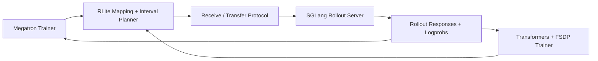

# RLite

**Ultra-lightweight infrastructure for LLM RL.**

RLite exists for one reason: people doing RL on LLMs should not have to spend half their time untangling trainer-runtime coupling, private framework forks, or bespoke weight-sync glue just to test a new algorithmic idea.

Today, many RL stacks such as OpenRLHF, veRL, or slime solve rollout/training coordination by tightly coupling themselves to modified or version-pinned Megatron and SGLang trees. That works, but it also means framework churn becomes your problem. RLite takes the opposite path.

RLite is **anti-intrusive by design**:

- keep Megatron, native `transformers` + FSDP, and SGLang as close to upstream as possible
- carry framework hooks as small out-of-tree patches instead of permanent forks
- treat weight exchange as a standalone systems problem
- let RL researchers bring their own trainer logic, reward model, and data loop

If Megatron is the fastest way to train, native `transformers` + FSDP is the easiest way to prototype, and SGLang is the fastest way to serve rollouts, you should be able to mix them without inheriting a monolithic framework.

## Why This Project Exists

There is a gap between what RL researchers want and what most RL frameworks optimize for.

Researchers want:

- a clean place to implement PPO, GRPO, DAPO, RLOO, rejection sampling, or new ideas
- freedom to change data flow without rewriting a serving stack
- the latest Megatron and latest SGLang
- predictable weight synchronization that respects TP/DP/EP layout
- minimal framework magic

Most existing stacks instead bundle:

- a specific orchestration runtime
- a specific trainer abstraction
- a specific inference path
- a private synchronization story tied to modified framework internals

RLite is the bridge layer, not the whole kingdom.

## What RLite Is

RLite is a small systems layer for cross-framework LLM weight exchange. It lets local or remote Megatron, native `transformers` + FSDP, and SGLang workers behave like one RL stack without forcing them into one runtime.

It provides:

- canonical weight mapping between `Megatron`, `Transformers`, and `SGLang`
- topology-aware planning for cross-framework resharding
- interval-backed logical coverage so TP shards, flat FSDP shards, and DTensor shards can share one planner
- an explicit receive lifecycle for zero-copy or minimal-copy weight updates
- a transport abstraction for direct tensor movement
- thin framework integrations instead of a monolithic RL runtime
- a minimal TinyZero-style example for local training plus remote rollout

It does **not** try to be:

- a full RL trainer framework
- a workflow/orchestration engine
- a replacement for Megatron or SGLang
- a new model-serving runtime

## RLite Vs Monolithic RL Stacks

| Axis | RLite | Typical monolithic RL stack |
| --- | --- | --- |
| Core idea | Bridge best-of-breed training + inference | Own the whole RL runtime |
| Megatron dependency | Prefer upstream | Often pinned or patched |
| SGLang dependency | Prefer upstream with thin patches | Often pinned or patched |
| Trainer logic | Bring your own | Framework-defined abstractions |
| Rollout engine | SGLang | Usually framework-selected |
| Weight sync | Explicit mapping + reshard planner + transport | Hidden in framework integration |
| Research ergonomics | Maximum flexibility | Higher convenience, less freedom |

## What It Does Today

Current functionality in this repo includes:

- weight mapping for `Qwen`, `GLM`, `LLaMA`, `GPT`, and `DeepSeek`
- Megatron-side snapshot collection and receive hooks
- native `transformers` + FSDP snapshot collection and receive hooks
- SGLang-side snapshot collection and receive hooks
- topology-aware exchange planning, including fan-in cases like `tp4 -> tp2+dp2`
- interval-backed transfer planning across row shards, column shards, flat FSDP1 shards, and DTensor-style FSDP2 shards
- explicit receive lifecycle:
  - `prepare_receive(...)`
  - `commit_receive(...)`
  - `abort_receive(...)`
- direct bindings for live tensors and direct `narrow()` views
- staged fallback with **per-parameter** ping-pong buffers, not a second full model image
- shard-native FSDP support without `summon_full_params()` or full-state-dict gathering:
  - FSDP1 via `FullyShardedDataParallel(..., use_orig_params=True)`
  - FSDP2 via default single-mesh-dimension `fully_shard(..., placements=[Shard(0)])`
- explicit fail-fast boundaries for layouts that would require a hidden gather, including unsupported transpose/reshape shard-local rules and grouped-expert flat-shard tensors without per-expert shard metadata
- a TinyZero-style countdown example for:
  - local Megatron actor update
  - remote SGLang rollout over HTTP
  - per-step Megatron -> SGLang sync

## Design Principles

### 1. Anti-intrusive

Framework submodules stay clean. If a framework hook is needed, it should live as a patch under `patches/`, not as a permanent fork inside the repo.

### 2. Zero-copy when possible

If a target binding can be represented as a live tensor or a direct view, the receive side should register that live region and let the transport write straight into it.

### 3. Minimal fallback when not

If a mapping cannot be direct, fallback is still bounded:

- per binding or per owner parameter
- no full-model shadow copy
- commit via swap or targeted writeback

### 4. Topology matters

Tensor parallelism, data parallelism, expert parallelism, host placement, NIC placement, and provider availability all affect the best transfer plan. RLite treats that as first-class.

### 5. Bring your own RL algorithm

The point is to make algorithm work easy, not to force everyone into one trainer abstraction.

## How It Works

RLite breaks cross-framework weight exchange into a few explicit steps.

### 1. Canonical mapping

Framework-specific parameter names are translated into canonical tensor identities so Megatron, HF, and SGLang shards can talk about the same logical weight.

Examples:

- fused QKV in Megatron -> split or fused attention weights in other frameworks
- grouped expert tensors -> per-expert canonical units
- TP-sharded local views -> logical global tensor regions
- flat-parameter FSDP shards and DTensor shards -> logical linear intervals backed by local storage segments

### 2. Planning

The planner builds an exchange plan from:

- source snapshots
- target snapshots
- parallel layouts
- host/NIC/provider topology

It emits:

- binding manifests
- transfer tasks
- expected source ranks for each target
- direct vs staged binding metadata

The planner works on logical interval overlap rather than only matching `shard_axis`, so Megatron, SGLang, FSDP1 flat shards, and FSDP2 per-parameter shards can participate in the same exchange core.

### 3. Receive preparation

Before the source sends anything, the target calls `prepare_receive(...)`.

That step:

- materializes target bindings
- registers live tensors or views for direct paths
- allocates bounded ping-pong buffers for staged fallback
- publishes rank descriptors for the transport layer

### 4. Data movement

The source executes only the send side of the exchange plan.

Path selection is one-hop and topology-aware:

- same-host GPU paths prefer `CUDA IPC`
- cross-host GPU paths prefer `libfabric RMA`
- staged host fallback is the last resort

### 5. Commit or abort

After transfers finish:

- `commit_receive(...)` finalizes staged bindings
- `abort_receive(...)` drops pending state cleanly

For direct bindings, commit is effectively bookkeeping. For staged bindings, commit applies only the affected owner buffer, not a whole-model writeback.

## Architecture



## Repository Layout

- [src/rlite/weight_mapping](/mnt/c/Users/zhang/RLite/src/rlite/weight_mapping): canonical name and shape mapping
- [src/rlite/resharding](/mnt/c/Users/zhang/RLite/src/rlite/resharding): planning, execution, receive lifecycle
- [src/rlite/transport](/mnt/c/Users/zhang/RLite/src/rlite/transport): transport contracts and backend integration
- [src/rlite/integrations](/mnt/c/Users/zhang/RLite/src/rlite/integrations): Megatron, native `transformers` + FSDP, and SGLang integration helpers
- [patches/sglang](/mnt/c/Users/zhang/RLite/patches/sglang): out-of-tree framework patches
- [examples/tinyzero_countdown_remote.py](/mnt/c/Users/zhang/RLite/examples/tinyzero_countdown_remote.py): minimal TinyZero-style RL example

## Non-Intrusive Framework Policy

This repo intentionally keeps framework modifications out of the submodules themselves.

Today that means:

- Megatron integration is handled from Python-side helpers in RLite
- native `transformers` + FSDP integration is handled from Python-side helpers in RLite
- SGLang integration is carried as thin patch files:
  - [0001-model-runner-rlite-hook.patch](/mnt/c/Users/zhang/RLite/patches/sglang/0001-model-runner-rlite-hook.patch)
  - [0002-http-server-rlite-receive-endpoints.patch](/mnt/c/Users/zhang/RLite/patches/sglang/0002-http-server-rlite-receive-endpoints.patch)

This makes it much easier to:

- track upstream framework releases
- inspect exactly what RLite needs from a framework
- rebase small hooks instead of maintaining a private fork forever

## Quickstart

### Megatron + Remote SGLang

#### 1. Clone and install

```bash
git submodule update --init --recursive
python3 -m pip install -e .[dev]
```

#### 2. Apply the thin SGLang patches

If you are using the bundled SGLang submodule:

```bash
git -C third-party/sglang apply ../../patches/sglang/0001-model-runner-rlite-hook.patch
git -C third-party/sglang apply ../../patches/sglang/0002-http-server-rlite-receive-endpoints.patch
```

If you are using your own SGLang checkout, apply the same patch files there instead.

#### 3. Start remote SGLang for rollout

RLite expects the remote rollout service to expose:

- standard generation over HTTP, for example `/v1/completions`
- the receive lifecycle endpoints added by the patches:
  - `/rlite/prepare_receive`
  - `/rlite/commit_receive`
  - `/rlite/abort_receive`

#### 4. Keep Megatron local

Your training script owns:

- local Megatron model state
- optimizer step
- reward shaping
- algorithm logic

RLite only handles the bridge.

#### 5. Use the TinyZero-style demo loop

The countdown demo shows the intended split:

- local Megatron actor update
- remote SGLang rollouts
- TinyZero-style rule reward
- group-normalized GRPO-style advantages
- per-step `tp4 -> tp2+dp2` sync

Minimal usage:

```python
from examples.tinyzero_countdown_remote import run_countdown_loop


def get_source_snapshots():
    # Return one RLite Megatron snapshot per local training rank.
    ...


def actor_step(batch):
    # Consume the prepared RL batch and run one Megatron actor update.
    ...


for stats in run_countdown_loop(
    get_source_snapshots=get_source_snapshots,
    actor_step=actor_step,
    remote_url="http://rollout-host:30000",
    rollout_model="default",
    steps=100,
):
    print(stats)
```

The example helper defaults to:

- training profile: `Qwen2.5`, `tp4`
- rollout profile: `Qwen2.5`, `tp2`
- rollout topology: `tp2 + dp2` with remote rank offset `4`

### Native Transformers + FSDP Helpers

If you do not need the patched SGLang service path, RLite also exposes helper-only entry points for shard-native `transformers` + FSDP exchange:

```python
from rlite.integrations import (
    abort_transformers_fsdp_receive,
    collect_transformers_fsdp_snapshot,
    commit_transformers_fsdp_receive,
    execute_transformers_fsdp_exchange,
    prepare_transformers_fsdp_receive,
    synthesize_transformers_fsdp_target_snapshots,
)
```

Use those helpers to:

- collect shard-native source snapshots from a live FSDP model
- synthesize shard-native target snapshots for a planned topology
- prepare, commit, or abort receive state on the target side
- execute one local execution slice against the generic transport layer

Current shard-local support is intentionally narrow:

- FSDP1 requires `use_orig_params=True`
- FSDP2 supports only a single mesh dimension with the default `Shard(0)` placement in this first pass
- layouts that would require a hidden full-parameter gather fail fast instead of silently gathering

## TinyZero-Style Example

The example in [tinyzero_countdown_remote.py](/mnt/c/Users/zhang/RLite/examples/tinyzero_countdown_remote.py) intentionally stays small.

It is **not** a port of veRL/Ray trainer machinery. It is a distilled proof that the bridge is enough to run a compact RL loop:

1. sample countdown prompts
2. call remote SGLang for grouped rollouts and token logprobs
3. score with a simple rule-based reward
4. normalize rewards within each group
5. run a local Megatron actor step
6. sync updated weights back to remote SGLang

That is the whole point of the project: algorithm developers should be able to focus on steps `2-5`, not on writing a framework fork.

## Current Validation

Targeted validation for the core path passes with:

```bash
PYTHONPATH=src python3 -m pytest -q \
  tests/test_weight_mapping.py \
  tests/test_resharding_planner.py \
  tests/test_resharding_execution.py \
  tests/test_resharding_receive.py \
  tests/test_resharding_integrations.py \
  tests/test_transformers_fsdp_integrations.py
```

Those tests cover:

- mapping coverage across major model families
- direct vs staged receive behavior
- planner metadata such as `requires_staging`, `fallback_bytes`, and interval overlap coverage
- `tp4 -> tp2+dp2` fan-in planning
- fake-FSDP1 and fake-FSDP2 shard-native metadata paths
- direct receive writeback into flat FSDP storage
- negative coverage for unsupported FSDP layouts and accidental gather paths
- end-to-end control-plane behavior for remote SGLang sync

## Who This Is For

RLite is for people who already know what RL loop they want, and do **not** want their research velocity capped by framework plumbing.

You will probably like this project if:

- you want Megatron for training and SGLang for rollout
- you want native `transformers` + FSDP without giving up explicit shard-local weight exchange
- you care about zero-copy or near-zero-copy weight updates
- you do not want to live on a permanent private fork of either framework
- you are iterating on new RL algorithms faster than framework authors can expose knobs for them

## Status

RLite is early, but the direction is clear:

- upstream-friendly framework integration
- explicit transport and resharding semantics
- one planner core shared across Megatron, SGLang, and native `transformers` + FSDP
- minimal examples that prove the bridge works
- enough systems structure to scale beyond a toy script, without turning into a giant framework

## License

This repository is licensed under Apache 2.0. See [LICENSE](/mnt/c/Users/zhang/RLite/LICENSE).
