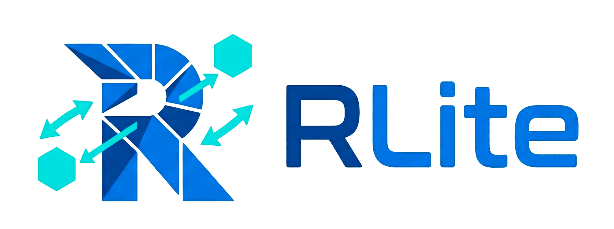
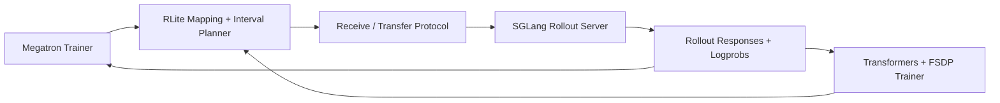

# RLite

<p align="center">
  
</p>

Lightweight infrastructure for cross-framework LLM weight exchange in reinforcement learning workflows.

RLite enables Megatron, native `transformers` + FSDP, and SGLang workers to exchange weights and operate together in one RL workflow without requiring a single monolithic runtime.

## Disclaimer

This project began as a vibe-coding experiment. At its current stage, the codebase is largely generated with the assistance of large language models and has not yet undergone comprehensive end-to-end validation.

The repository should therefore be treated as an early-stage prototype rather than a production-ready system. While individual components and ideas may be useful, correctness, robustness, and integration completeness are still being established.

Community feedback and contributions are very welcome. If you are interested in improving reliability, testing, documentation, or overall design, we would be glad to have your help.

## Features

Current functionality in this repository includes:

- weight mapping for `Qwen`, `GLM`, `LLaMA`, `GPT`, and `DeepSeek`
- Megatron-side snapshot collection and receive hooks
- native `transformers` + FSDP snapshot collection and receive hooks
- SGLang-side snapshot collection and receive hooks
- topology-aware exchange planning, including fan-in cases such as `tp4 -> tp2+dp2`
- interval-backed transfer planning across row shards, column shards, flat FSDP1 shards, and DTensor-style FSDP2 shards
- explicit receive lifecycle:
  - `prepare_receive(...)`
  - `commit_receive(...)`
  - `abort_receive(...)`
- direct bindings for live tensors and `narrow()` views
- staged fallback with per-parameter ping-pong buffers rather than a second full model image
- shard-native FSDP support without `summon_full_params()` or full-state-dict gathering:
  - FSDP1 via `FullyShardedDataParallel(..., use_orig_params=True)`
  - FSDP2 via default single-mesh-dimension `fully_shard(..., placements=[Shard(0)])`
- fail-fast handling for layouts that would require hidden gathers or unsupported shard-local transformations
- a minimal RL example for:
  - local Megatron actor update
  - remote SGLang rollout over HTTP
  - per-step Megatron-to-SGLang synchronization

## Best Practices

Most training code should start with one of these integration helpers instead of the lower-level planner APIs:

| Use case | Helper | Signature | Notes |
| --- | --- | --- | --- |
| Megatron -> remote SGLang sync | `sync_megatron_to_remote_sglang(...)` | `sync_megatron_to_remote_sglang(source_snapshots, *, train_profile, rollout_profile, topology, remote_url)` | Recommended default for an RL loop. Plans the exchange, prepares the remote receive, sends local shards, and commits the remote update. |
| Megatron custom source-side sync | `collect_megatron_snapshot(...)` | `collect_megatron_snapshot(model, profile, role=..., *, rank_offset=0, host=None, nic_names=(), provider_names=())` | Use when your trainer owns the control flow but still needs to expose live Megatron shard state to RLite. |
| `transformers` + FSDP custom sync | `collect_transformers_fsdp_snapshot(...)` | `collect_transformers_fsdp_snapshot(model, profile, role=..., *, rank_offset=0, host=None, nic_names=(), provider_names=())` | Collects shard-native FSDP state without `summon_full_params()` or a hidden full-parameter gather. |
| `transformers` + FSDP execution of one planned local slice | `execute_transformers_fsdp_exchange(...)` | `execute_transformers_fsdp_exchange(model, profile, execution_slice, coordinator, *, transport_session=None, role=..., rank_offset=0, host=None, nic_names=(), provider_names=())` | Use when you already have a plan and coordinator and want RLite to execute the local FSDP portion. |

For most users, the practical guidance is simple:

- if you train with Megatron and serve with remote SGLang, call `sync_megatron_to_remote_sglang(...)`
- if you are building a custom integration, call one of the `collect_*_snapshot(...)` helpers first
- if you are manually driving a planned FSDP exchange, call `execute_transformers_fsdp_exchange(...)`

Minimal Megatron -> remote SGLang pattern:

```python
from rlite.integrations import (
    RemoteTopology,
    collect_megatron_snapshot,
    sync_megatron_to_remote_sglang,
)


def get_source_snapshots(local_models, train_profile):
    return tuple(
        collect_megatron_snapshot(model, train_profile)
        for model in local_models
    )


rollout_topology = RemoteTopology.from_grid(
    framework="sglang",
    tp_size=2,
    dp_size=2,
    rank_offset=4,
)

source_snapshots = get_source_snapshots(local_models, train_profile)
sync_megatron_to_remote_sglang(
    source_snapshots,
    train_profile=train_profile,
    rollout_profile=rollout_profile,
    topology=rollout_topology,
    remote_url="http://rollout-host:30000",
)
```

Most users should not need `build_exchange_plan(...)`, `prepare_receive(...)`, or `commit_receive(...)` directly unless they are integrating a new runtime or implementing a new remote receive service.

## Quickstart

### Megatron + Remote SGLang

#### 1. Clone and install

```bash
git submodule update --init --recursive
python3 -m pip install -e .[dev]
```

#### 2. Apply the SGLang patches

If you are using the bundled SGLang submodule:

```bash
git -C third-party/sglang apply ../../patches/sglang/0001-model-runner-rlite-hook.patch
git -C third-party/sglang apply ../../patches/sglang/0002-http-server-rlite-receive-endpoints.patch
```

If you are using your own SGLang checkout, apply the same patch files there.

#### 3. Start the remote SGLang rollout service

RLite expects the remote rollout service to expose:

- standard generation over HTTP, for example `/v1/completions`
- the receive lifecycle endpoints added by the patches:
  - `/rlite/prepare_receive`
  - `/rlite/commit_receive`
  - `/rlite/abort_receive`

#### 4. Keep training local

Your training script remains responsible for:

- local Megatron model state
- optimizer updates
- reward computation
- RL algorithm logic

RLite handles only the bridge between systems.

#### 5. Run the example loop

The countdown example demonstrates the intended split:

- local Megatron actor updates
- remote SGLang rollouts
- rule-based reward computation
- group-normalized GRPO-style advantages
- per-step `tp4 -> tp2+dp2` synchronization

Minimal usage:

```python
from examples.tinyzero_countdown_remote import run_countdown_loop


def get_source_snapshots():
    # Return one RLite Megatron snapshot per local training rank.
    ...


def actor_step(batch):
    # Consume the prepared RL batch and run one Megatron actor update.
    ...


for stats in run_countdown_loop(
    get_source_snapshots=get_source_snapshots,
    actor_step=actor_step,
    remote_url="http://rollout-host:30000",
    rollout_model="default",
    steps=100,
):
    print(stats)
```

The example helper currently defaults to:

- training profile: `Qwen2.5`, `tp4`
- rollout profile: `Qwen2.5`, `tp2`
- rollout topology: `tp2 + dp2` with remote rank offset `4`

## Integration Helpers

For shard-native `transformers` + FSDP exchange without the patched SGLang service path, RLite also exposes helper-only entry points:

```python
from rlite.integrations import (
    abort_transformers_fsdp_receive,
    collect_transformers_fsdp_snapshot,
    commit_transformers_fsdp_receive,
    execute_transformers_fsdp_exchange,
    prepare_transformers_fsdp_receive,
    synthesize_transformers_fsdp_target_snapshots,
)
```

These helpers can be used to:

- collect shard-native source snapshots from a live FSDP model
- synthesize shard-native target snapshots for a planned topology
- prepare, commit, or abort receive state on the target side
- execute a local execution slice against the generic transport layer

Current shard-local support is intentionally limited:

- FSDP1 requires `use_orig_params=True`
- FSDP2 currently supports only a single mesh dimension with default `Shard(0)` placement
- layouts that would require a hidden full-parameter gather fail fast rather than silently gathering

## Architecture



## Design Notes

RLite is structured around a few implementation choices:

- canonical mapping between framework-specific parameter names and logical tensor identities
- interval-based planning so TP shards, flat FSDP shards, and DTensor shards can participate in the same planning core
- explicit receive preparation, data movement, and commit or abort steps
- direct writes into live tensors or views when possible
- bounded staged fallback when direct binding is not possible
- topology-aware transfer decisions across host, NIC, and provider layout

The repository is intended as infrastructure rather than a full RL trainer, orchestration layer, or model-serving runtime.

## Framework Integration Policy

This repository intentionally keeps framework modifications outside framework submodules.

At present:

- Megatron integration is handled through Python-side helpers in RLite
- native `transformers` + FSDP integration is handled through Python-side helpers in RLite
- SGLang integration is provided through small patch files:
  - `0001-model-runner-rlite-hook.patch`
  - `0002-http-server-rlite-receive-endpoints.patch`

This makes it easier to:

- follow upstream releases
- inspect the exact hooks required by RLite
- maintain small, reviewable changes instead of large private forks

## Example Provenance

The example in `examples/tinyzero_countdown_remote.py` is a minimal RL demonstration inspired by the style of TinyZero.

TinyZero is a separate project. This repository does not repackage TinyZero or veRL as part of RLite. The example is included only to show that RLite’s bridge layer is sufficient to support a compact RL workflow with local training and remote rollout serving.

The example demonstrates:

1. prompt sampling
2. grouped remote rollouts with token log probabilities
3. simple reward computation
4. within-group reward normalization
5. local actor updates
6. weight synchronization back to the rollout service

Credit for the minimal-task demonstration style belongs to the TinyZero project and its authors.

## Repository Layout

- `src/rlite/weight_mapping`: canonical name and shape mapping
- `src/rlite/resharding`: planning, execution, and receive lifecycle
- `src/rlite/transport`: transport contracts and backend integration
- `src/rlite/integrations`: Megatron, native `transformers` + FSDP, and SGLang integration helpers
- `patches/sglang`: out-of-tree framework patches
- `examples/tinyzero_countdown_remote.py`: minimal RL example

## Validation

The core path is currently validated with:

```bash
PYTHONPATH=src python3 -m pytest -q \
  tests/test_weight_mapping.py \
  tests/test_resharding_planner.py \
  tests/test_resharding_execution.py \
  tests/test_resharding_receive.py \
  tests/test_resharding_integrations.py \
  tests/test_transformers_fsdp_integrations.py
```

These tests cover:

- mapping coverage across major model families
- direct versus staged receive behavior
- planner metadata such as `requires_staging`, `fallback_bytes`, and interval overlap coverage
- `tp4 -> tp2+dp2` fan-in planning
- fake-FSDP1 and fake-FSDP2 shard-native metadata paths
- direct receive writeback into flat FSDP storage
- negative coverage for unsupported FSDP layouts and accidental gather paths
- end-to-end control-plane behavior for remote SGLang synchronization

## License

This repository is licensed under Apache 2.0. See `LICENSE`.
